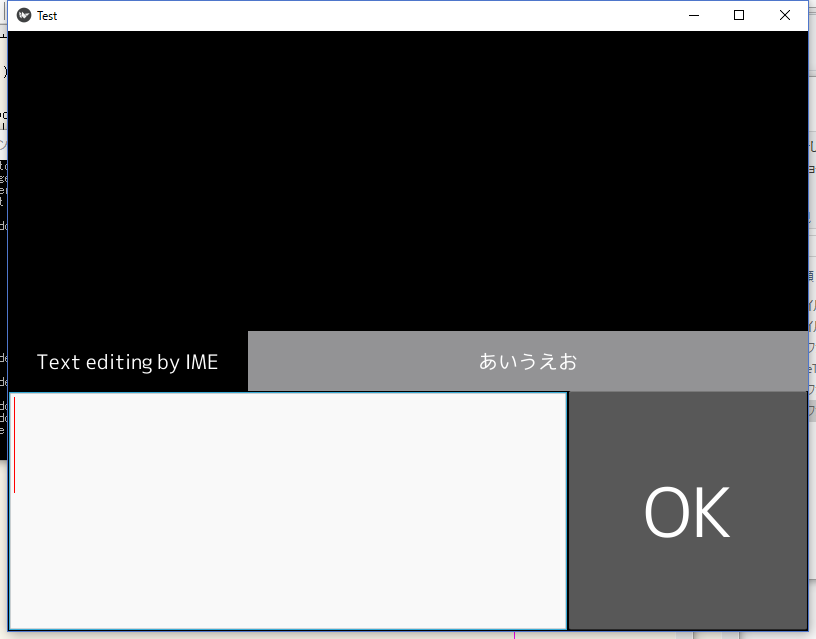
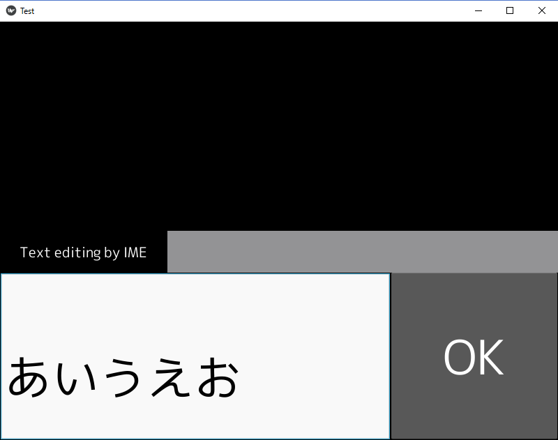

# kivy_textedit_sample
Sample of textedit event 

## Editing

Full-width characters being entered are displayed in the "Text editiing by IME" label.

## Cpmplete edit

After entering the enter key, letters are displayed in the TextInput widget when the input is confirmed.

## About use font
This sample uses M + FONTS font. This font is a free font.

Official site https://mplus-fonts.osdn.jp/